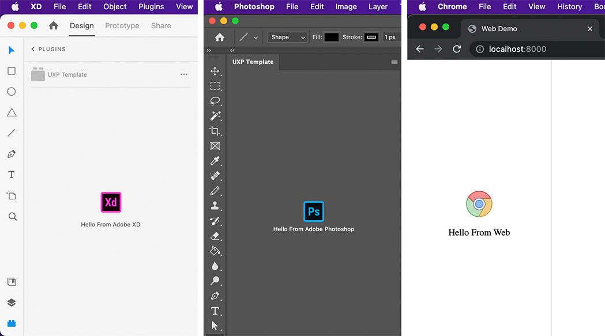

# UXP template for Adobe Xd and Photoshop

With this template you can develop plugin for adobe xd and photoshop.



Please write all the platform specific code to the platform respective entry file ([main.xd.tsx](./src/main.xd.tsx), [main.ps.tsx](./src/main.ps.tsx))

### Adobe Xd:

Entry File: [main.xd.tsx](./src/main.xd.tsx)

```sh
# for running the development server for Adobe Xd
$ npm run dev:xd
```

### Adobe Photoshop:

Entry File: [main.ps.tsx](./src/main.ps.tsx)

```sh
# for running the development server for Adobe Photoshop
$ npm run dev:ps
```

### Web

Entry File: [main.web.tsx](./src/main.web.tsx)

```sh
# if you want to see the ui only
$ npm run dev:web
$ npm run serve:web
```

### Pack for distribution

```sh
$ npm run pack:xd # For Adobe Xd
$ npm run pack:ps # For Adobe Photoshop
```

it will generate **adobe-xd.xdx** and **photoshop.ccx**
